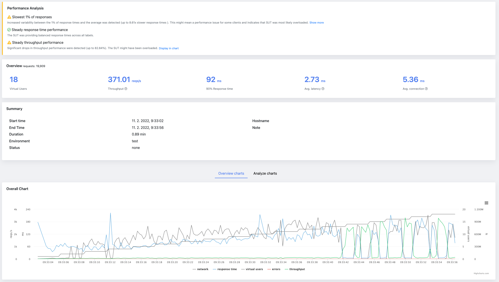
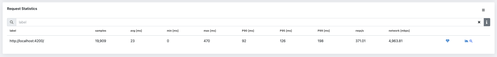
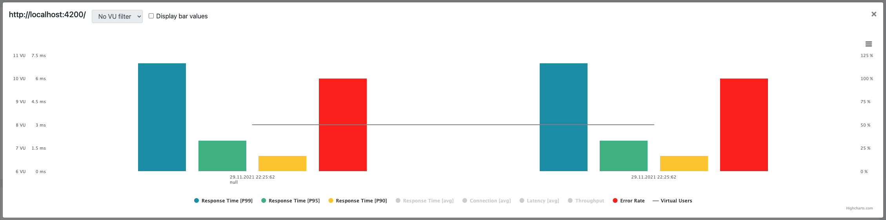

Performance testing is an important aspect of software development, as it helps ensure that a system or application can handle the expected workload and user traffic.
A performance testing report is a document that outlines the results of a performance test and provides insights on the system's performance under various conditions.

There are various types of performance tests, including load testing, stress testing, and endurance testing. Load testing involves simulating a normal workload on the system to ensure it can handle the expected traffic. Stress testing involves increasing the workload beyond normal levels to see how the system performs under increased demand. Endurance testing involves running the system at a high workload for an extended period of time to ensure it can sustain that level of performance.

A performance testing report should include a summary of the test objectives, the testing environment, and the test results. It should also include any issues or bottlenecks that were identified during the testing process and provide recommendations for improvement.

One key aspect of a performance testing report is the use of performance metrics. These metrics can help identify areas of the system that may need improvement and provide a baseline for future performance testing. Common performance metrics include response time (90, 95 and 99 [percentiles](../../07/07/percentiles), average, min and max), throughput, error rate, connection time, networks stats. All of these metrics are provided in JtlReporter. The more, you can adjust the displayed metrics as wanted - by default the application shows all the metrics in the table, but if you feel it's too overwhelming you can easily limit it.

Another important aspect of a performance testing report is the presentation of the results. The report should include graphs and charts to clearly show the test results and make it easy for readers to understand the findings. JtlReport renders all basic graphs for overall performance, but also for individual labels and its various metrics. But it does not stop here. It even adds a possibility to display a trends for individual labels - you will get a history timeline of a performance per label.

But it also gives you the possibility to create custom charts where you can combine all the available metrics as wanted to find the desired correlation. This custom chart is saved per user session and loaded when report is opened.

Performance testing report is a valuable document that provides insights on the performance of a system or application under various conditions. It can help identify issues and bottlenecks, provide recommendations for improvement, and serve as a baseline for future performance testing.

Do you want to get more from your JMeter or Locust.io performance test? [Get started](/docs/) with JtlReporter.
