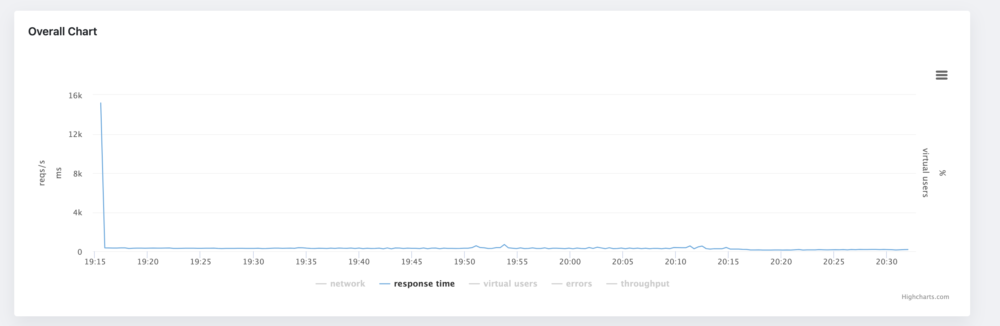
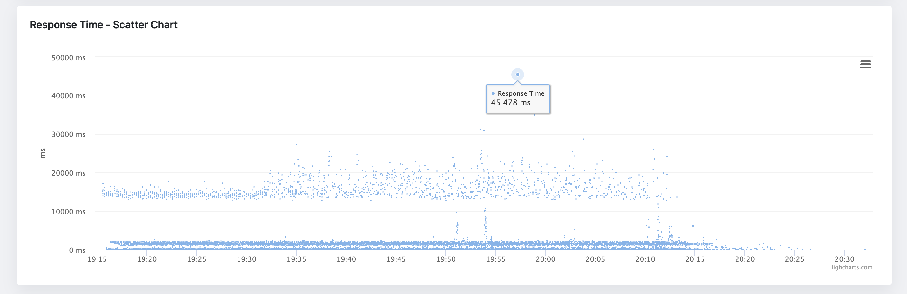

As a performance tester, one of the most important tasks is to correctly analyze the performance testing results.
Although it might look like an easy task, the opposite is true here. When looking at the performance test report metrics and charts, there are many hidden traps.
The biggest one is, the data you are looking at are aggregated. The problem with aggregated metrics is that
they hide information from you (and averages are among the worst here), like very small spikes in response times.
But those spikes still pose a performance bottleneck, that needs to be solved.

One of the most effective ways to visualize performance testing data is through scatter charts.
It is particularly useful in performance testing because it can help you to identify patterns and trends in your raw data, as well as potential performance issues.
Look at the following example of aggregated chart displaying an average response time of a web application:

As you can see, the information we can get from this chart is limited. It does not show almost any pattern in the data.
The only thing we can read from it, there was initially a spike in response times (still worth investigating further as this looks like a performance bottleneck),
but besides that, that's all we can get from this chart. Now, let's look at the same data, but this time in a scatter chart:

The scatter is more informative than the average response time chart. It shows us that the response times are grouped into three clusters.
The banding pattern is usually fine, but in this case, the spacing between the clusters seems to be bigger than desired - the clusters are roughly defined around 0-100ms, 1000-200ms, and 12000-2000ms.
Another pattern we can see here is that on some occasions, the response times form almost a vertical line. This might signify a performance bottleneck in the application as something might be blocking the request processing.
And last, but not least, we can see that there are some outliers in the data. The outliers are the points that are far away from the rest of the data. The question here is, are they outliers or do they have statistical significance?
Again, here we would need to investigate further and run the test multiple times to see if the outliers are consistent.

In this quick introduction, we have learned how scatter charts can help us to analyze performance testing outputs, and reveal patterns and trends in the data,
that are otherwise hidden in the aggregated charts. Luckily, the scatter chart is now included in the JtlReporter in the latest version, so you can get even more out of your performance
testing data and make better decisions about your application performance.
