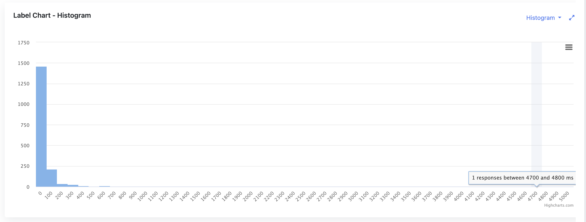

In performance testing, it is integral to have detailed, accurate methods for trending and variability analysis. 
A useful visual tool that helps in this regard is the histogram. Using histograms in performance testing reports can aid in the breakdown of data distribution,
revealing the shape and spreading of performance test data, thus enhancing understanding of test results. 

## Relationship Between Histograms and Standard Deviation in Performance Testing
A histogram complements other measures of data distribution, such as [standard deviation](/blog/2023/07/14/performance-testing-metric-standard-deviation). 
While [standard deviation](/blog/2023/07/14/performance-testing-metric-standard-deviation) elucidates the degree of data dispersion from the mean,
histograms visually portray data grouping in intervals, clearly highlighting the frequency of data occurring within these intervals.
The marriage of histograms and standard deviation can lead to a more comprehensive understanding of data distribution.

The histogram uses its visual prowess to depict and highlight the position and range of all data points grouped into bins,
while standard deviation uses its mathematical sharpness to assess the dispersion and deviation of the data. 
Collaboratively, they provide us nuanced way for understanding of the distribution of collected data samples.

## Understanding Normal Distribution in Histograms 
A critical concept represented by histograms in performance testing is normal distribution, which often emerges as a likely outcome.
Normal distribution, depicted as a bell curve, signifies that most data points cluster near the mean,
with the frequency gradually declining as they diverge from the center. This renders the normal distribution pattern symmetric. 

In performance testing, such normal distribution might indicate a stable system where the majority of response times congregate around a central value. 
Observing an abnormally shaped histogram or one with significant skewness, conversely, may reveal system performance issues.

Hence, understanding normal distribution in the performance testing context is an essential skill for testers. 
It is a visual cue in the histogram that carries great weight. Moreover, it aids in forming informed expectations about system behavior.
So, as testers, our eye on the histogram should always look out for the bell curve of normal distribution.

## Utility and Relevance of Histograms in Performance Testing Reports
Given their ability to elucidate data patterns visually, histograms hold high utility in performance tests reports. 
They furnish testers with an easy-to-understand, intuitive breakdown of data distribution over a range of response times.

With bins on the horizontal axis representing data ranges and bars on the vertical axis signifying the frequency of data within these ranges,
histograms aptly illustrate the concentration and dispersion of response times. 
Consequently, they yield important insights into system response behavior under different workloads. 

Additionally, reviewing histograms over sequential test runs can help identify trends, and brief or sustained changes,
aiding system fine-tuning and optimization. 

The profound relevance of histograms encompasses providing insights into extreme values too. 
A sudden tall peak in a histogram could indicate an outlier identify, data points that deviate significantly from the mean,
that needs to be investigated and analyzed to ensure the robustness and reliability of a system.
Another example would be a histogram that is heavily skewed or has multiple peaks, for instance, may signify issues with system balance 
or the existence of multiple user groups with different behavior. 
A narrow histogram indicates a potentially healthier system with consistent response times. 
On the other hand, a broad, flat histogram may point toward a system with unpredictable response times, 
highlighting areas that need improvement for better performance consistency.

With the ability to illuminate the grey areas of data distribution, spotlight outliers,
and, above all, present complicated data in an accessible, user-friendly format, 
histograms hold high relevance in the world of performance testing reports.

## Closing Thoughts
In sum, histograms play a pivotal role in the domain of performance test reports. As a visualization tool, 
they work in tandem with measures like standard deviation to offer a comprehensive perspective on data distribution. 
By illustrating patterns such as normal distribution and highlighting outliers, 
they significantly assist in performance testing analytics and deepen the understanding of test results. 

Histogram chart is available in JtlReporter for every label, so you can analyze every sampler individually, and it gives you
also the ability to compare histograms of two different performance testing reports. [Get started](/docs/) with JtlReporter today!
