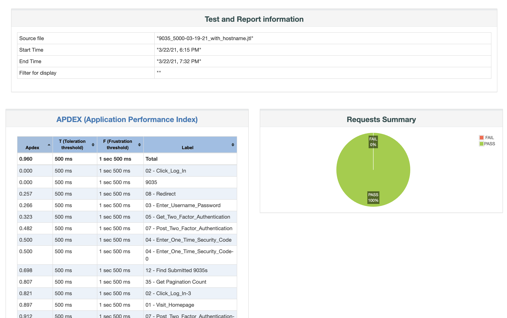

JMeter, also known as Apache JMeter, is a powerful open-source software that you can use to perform load testing, functional testing, and performance measurements on your application or website. It helps you understand how your application behaves under different levels of load and can reveal bottlenecks or issues in your system that could impact user experience. 
This article will guide you on how to generate a JMeter Dashboard Report, ensuring that you utilize this critical tool productively and effectively for your application performance optimization.

## Software Requirements
To generate a JMeter Dashboard Report, certain software prerequisites must be met. Firstly, Apache JMeter, the load-testing tool, should be installed on your system, with the latest stable release preferred. Secondly, given JMeter's Java base, you'll also need to install the Java Development Kit (JDK), preferably the latest version. Don't forget to set your JAVA_HOME environment variable to your JDK installation path. Lastly, depending on your testing needs, additional plugins or applications may be necessary for data analysis or software integration with JMeter.

## Detailed Step-by-step Guide on How to Generate JMeter Dashboard Report
### Setting up the Environment
First, confirm that JMeter and JDK are installed correctly. You can do this by opening a command prompt (or terminal in Linux/Mac) and typing `jmeter -v` and `java -version`. These commands should return the JMeter and JDK versions installed on your PC, respectively. Next, open JMeter application. Choose your preferred location to store the output. It should be a place where JMeter can generate results and graphs. Set up your test plan. A test plan specifies what to test and how to run the test. You can add a thread group to the test plan and configure the number of users, ramp-up period, and loop count, among other parameters.

### Planning and Executing the Test
Add the necessary samplers to the thread group. Samplers tell JMeter to send requests to a server and wait for a response. 
Now add listeners to your test plan. Listeners provide access to the data gathered by JMeter about the test cases as a sampler component of JMeter is executed.
Execute your test plan. You can run your test by clicking the "Start" button (green triangle) on the JMeter tool's top bar.

### Generating the Report
To create your Dashboard Report from the JTL file, go to the command line, navigate to your JMeter bin directory, and use the following command:

`jmeter -g [path to JTL file] -o [folder where dashboard should be generated]`.

After running this command, JMeter generates a Dashboard Report in the specified output folder. This report includes various charts and tables that present a visual analysis of your performance test.

## Understanding JMeter Dashboard Report
1. Top Level (Summary): This section provides an overview of the test, including test duration, total requests, errors, throughput (requests per second), average response time, and more. 
2. [APDEX (Application Performance Index)](/blog/understanding-apdex-metric): This index measures user satisfaction based on the response times of your application.
3. Graphical representation of Results: JMeter includes various charts such as throughput-over-time, response-time-over-time, active-threads-over-time, etc. Each of these graphs provides a visual representation of your test's metrics over different time spans.
4. Request Summary: This table provides more detailed information for each sampler/request, such as median, min/max response times, error percentages, etc.

## Key Metrics in the Report
Some of the essential metrics you will come across in a JMeter Dashboard report include:
1. Error %: The percentage of requests with errors.
2. Throughput: Number of requests per unit of time that your application can handle.
3. Min / Max time: The least / maximum time taken to handle the requests.
4. [90 % line](/blog/2023/07/07/performance-testing-metric-percentiles): 90 percent of the response times are below this value.

## Interpreting the Report
Interpreting the Dashboard Report involves looking at these metrics and evaluating whether they meet your application's performance requirements.
1. The Error % should ideally be zero. Any non-zero value indicates problems in the tested application or the testing setup.
2. High throughput with low response time indicates good performance. However, if response time increases with throughput, it might signal performance issues.
3. [The 90% line](/blog/2023/07/07/performance-testing-metric-percentiles) is often taken as the 'acceptable' response time. If most of the response times (90%) are within this limit, the performance is generally considered satisfactory.
4. [The APDEX score](/blog/understanding-apdex-metric), ranging from 0 to 1, should ideally be close to 1. A value less than 0.7 indicates that the performance needs improvement.
   By understanding these key points, you can interpret JMeter Dashboard Report effectively, enabling you to draw conclusions about your application's performance and plan improvements accordingly.

## Conclusion
The JMeter Dashboard Report is a powerful tool that provides insights into the performance of your website or application. 
This extensive and visual report allows you to ascertain the performance bottlenecks and potential room for optimization, 
thereby enabling you to enhance the end-user experience. 

Alternatively, you can get performance testing reports with JtlReporter. With JtlReporter, you can quickly and easily create comprehensive and easy to understand performance test reports for your system with metrics, such as requests per second, various percentiles, error rate, and much more. 
Additionally, you can compare test runs side-by-side, create custom charts with any metrics available, and set up notifications for external services to be informed when a report is processed [and more](/docs/introduction/features).

[Try JtlReporter](/docs/) today and get detailed performance test reports with ease!
