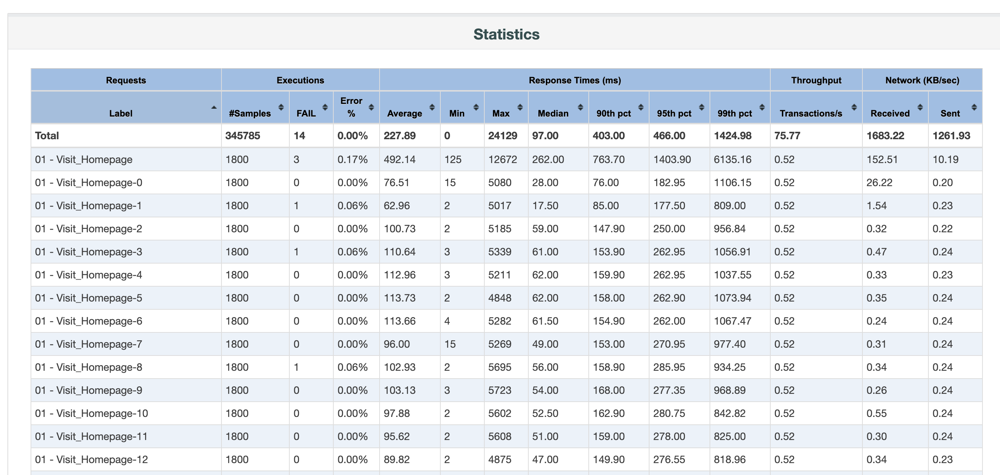

JMeter, a popular open-source software tool designed for load testing and performance measurement,
provides a built-in reporting feature known as the 'Dashboard Report'. The Report gathers or collates the
results of performance tests, depicting them in an easy-to-comprehend tabular format and graphs. In this article
we will have a look at the "Statistics" table.

Although the detailed process of generating this report is beyond the scope of this article, we have another post where
you can find out how to generate the [JMeter Dashboard Report](/blog/how-to-generate-jmeter-dashboard-report).

## The Importance of the Statistics in JMeter Report
The Statistics table in JMeter Dashboard Report is an integral part of performance testing analysis due to its comprehensive view of test results. 
It presents summarized information, including the average, median, and percentiles of response times, error percentage,
throughput, and more, all of which help identify bottlenecks in application performance. 
Understanding the Statistics Report is crucial as it provides valuable insights into application behavior under different load conditions; 
thus, it aids in determining scalability, reliability, and capacity planning. It forms the basis to uncover potential performance issues,
optimize system performance, and ensure a seamless user experience.

## Detailed Analysis of the Aggregate Report
The detailed analysis of the Aggregate Report in JMeter involves examining various columns that provide information about the performance of the application. 
Key metrics include:

* Label Name: name of sampler.
* Number of Samples: the total number of requests made.
* Average, Min, Max, Median, [90th, 95th and 95th percentile](/blog/2023/07/07/performance-testing-metric-percentiles): These indicate the various response times, respectively, providing a clear perspective on overall application performance.
* Throughput: Number of requests per unit of time that your application can handle. 
* Number of failed requests and Error %: This presents the total number of failed requests and their rate as compared to the total requests, signaling issues if the value is high.
* Network - Received and Sent: The amount of data being transferred in both directions, represented as KB/sec.

Each of these columns in the Statistics Report furnishes a different piece of the performance puzzle. 
They collectively give us a well-rounded view of the system's performance under assorted load conditions. 
Detailed analysis of these metrics helps to detect weak attributes and areas that need further improvement to ensure an optimized and seamless user experience. 
This analysis also helps us establish a foundational understanding of the system requirements,
guiding strategic improvement plans and facilitating better performance.

## Interpreting the Results From the Statistics Report
Interpreting results from the JMeter Statistics Report involves deciphering data from each column to gain insights into application performance. 
For instance, prolonged response times indicates potential performance hiccups, while variations in Min and Max response times could imply inconsistent performance.
A high Error % could be a red flag reflecting issues with server capacity or backend programming. Low throughput value together with long response times, most likely
means a bottleneck in the application or infrastructure.
By correctly reading and interpreting this data, you can identify potential problem areas, such as system stress points, bottlenecks, or areas of inefficiency.
These insights provide a useful foundation for defining corrective measures and performance optimization strategies.

It helps you develop a forward-looking perspective and create an action plan to enhance your performance strategy, ensuring a robust and seamless user experience.

## Limitations of the Statistics Report
While the Statistics Report in JMeter Dashboard is indispensably beneficial, it possesses limitations.
Primarily, it cannot display the values over time, for this, we need to have a look at the included graphs. For instance, the throughput could seem
acceptable but by looking at the graph we could spot some drops in the performance that would be worth further investigation. This applies to most of the
provided metrics - we need to have a look at the graphs to spot the patterns of potential performance hiccups.
The Statistics table misses for instance a [standard deviation](/blog/2023/07/14/performance-testing-metric-standard-deviation), a measure of how much the data deviates from the mean or average value. It provides valuable insights into the consistency and reliability of a given metric.
Another drawback is that finding the respective graph for a given label requires you to go to another tab and find the correct label among the others.
Last, but not least, it's not very easy to compare those metrics with another report, for instance, you want to assess the new changes in your application
and compare it with the state before those changes. That's where JtlReport could be handy. It addresses all the above-mentioned issues: [easy test report comparison](/docs/introduction/features#test-run-comparison),
[configurable request statistics](/docs/introduction/features#request-statistics-customization) including the standard deviation, graphs integrated into request statistics table and much more.
