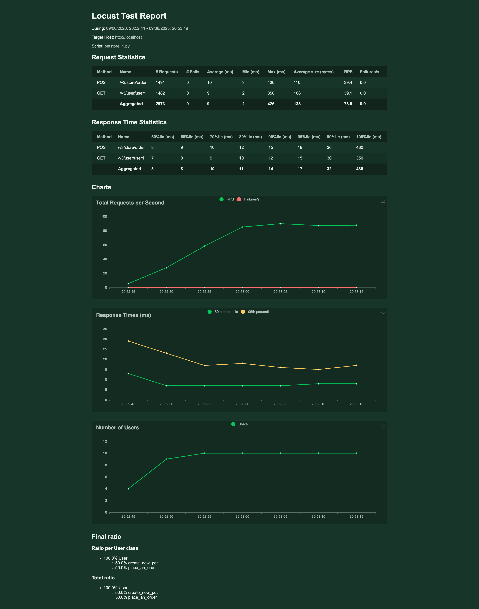

Locust.io is a highly effective open-source performance testing tool designed to help developers ascertain how their systems will function under the stress of multiple users. 
By simulating simultaneous users, locust.io provides comprehensive insights into system performance and potential points of failure.
It's Python-based and allows developers to write test scenarios in the form of Python scripts. 
This offers a significant degree of flexibility when it comes to generating specific user behaviors. The software is easy to use and offers efficient load-testing capabilities, including an informative HTML report feature. 
This article delves into how to generate and understand these HTML reports to make the most of locust.io for optimum system performance.

## Procedure to Generate HTML Report Using Locust.io
Creating an HTML report in locust.io is a relatively straightforward process that delivers insights into your system's performance. Follow these steps to create your own HTML report:

The article assumes locust.io is installed on your machine, and you have an existing locust script. 

1. After writing test cases, run locust using the command line. Use the following command: `locust -f locustfile.py --html=report.html`. Replace "locustfile.py" with your file's name, and "report.html" should represent the name of your output file.
2. Open the locust interface, typically running at http://localhost:8089. Set the number of total users to simulate and spawn rate, then start swarming to initiate the test.
3. Once you have finished the test case, an HTML report will be automatically generated.

Generating these regular reports is vital for assessing performance over time, which allows developers to catch potential problems early and avoid system breakdown due to high loads. It aids in monitoring system behavior under various load patterns, aiding in detecting bottlenecks, capacity constraints, and possibilities for optimization. By comprehending these reports, one can better maintain system stability and ensure an excellent user experience.

## Understanding the Report
Understanding locust.io's HTML report is crucial to extract useful insights about your system's performance. Testing with locust.io results in an HTML report with several data fields and sections. Here's how to interpret the key sections.

### Statistic Table
The report opens with a statistic table that includes the number of requests made, their distribution, and frequency. Three key parameters here are:

* Requests/sec: This is the number of completed requests per second.   
* Fails: This includes the counts and the percentage of failures.
* Failures/sec: This is the number of failed requests per second
* Median & Average Response Time: These figures indicate how long it took to process the requests, with the median being the middle value in the time set. But please note, that average is not the best metric to follow, actually they might be a [misleading metric](/blog/2023/07/07/performance-testing-metric-percentiles#difference-between-percentiles-and-averages).

### Distribution Stats
This table shows the distribution of response times, which is vital to understand the user experience at different percentiles of the load. 
The most often considered percentiles are p50(median), p90, p95 and p99. If the concept of percentile is new to you, please check [Performance Testing Metric - Percentile](/blog/2023/07/07/performance-testing-metric-percentiles), as this is metric is crucial in performance testing.

### Charts
In the end, there are three different charts displaying the number of users, Response times, and Requests per second. These charts provide a visual reference for the system's performance over time.
As you can see those are aggregated charts from all request, you cannot see there charts for individual requests.

These data points collectively provide a basic view of how the system performed under the simulated load. Those charts can provide some insights into application performance overtime, but won't reveal
subtle nuances - such as performance drops in individual requests. Those drops can be easily hidden in the aggregated charts.

## Key Metrics Measured by Locust.io
Key metrics are fundamental to assessing how well your system performed under testing. Some of the crucial metrics measured by locust.io include the following.

* Response Time: This is the time taken by a system to respond to a user request. It is provided in locust.io's report in various forms - percentiles, average, min and max response time. Lower response times generally indicate better performance. Unfortunately, Locust.io does not provide us with [standard deviation](blog/2023/07/14/performance-testing-metric-standard-deviation), which is helpful
in system performance stability assessment. Instead, you could have a look at the difference between min response time and average. If the there is a big difference between them, it might indicate a performance bottleneck.
* Error Rate: Represented as 'Fail' in the report, this measures the number and percentage of failed requests in relation to total requests made. In an ideal situation, the error rate should be zero; however, when performing intense load-testing, it's common to see some errors which can help identify potential weak points or bugs in the system.
* Requests Per Second: This denotes the number of requests a system can handle per second. A higher number indicates better system performance. It plays a crucial role in determining if your system can handle high traffic while still providing decent response times. Please refer to our other article if you would like to know the [difference between the number of virtual users and RPS](/blog/2021/04/21/virtual-users-vs-rps).

These metrics, in conjunction with others provided in locust.io's HTML report, provide a basic overview of your system's performance under load. By regularly monitoring these metrics, developers can ensure their systems are always ready to handle actual user traffic.

## Decoding Performance Metrics with Locust.io & Glimpsing Beyond with Jtl Reporter
In conclusion, locust.io provides a robust and reasonably detailed approach to performance testing with its capacity to simulate thousands of users and generate insightful HTML reports. Its easy-to-understand report format allows developers to interpret key metrics such as response time, error rate, and requests per second effectively. Regular report generation is also vital to continually improve system performance and catch potential problems early.

However, while locust.io's HTML offers neat features, alternatives like JtlReporter offer more flexibility and features. JtlReporter can provide rich analytic features, supportive visual charts, and even storage options for test results. Its user-friendly interface and detailed analysis can provide a comprehensive overview of system performance, which can be a perfect fit for highly complex large-scale systems. Therefore, while utilizing locust.io for performance testing, give a [JtlReporter a try](/docs/).
