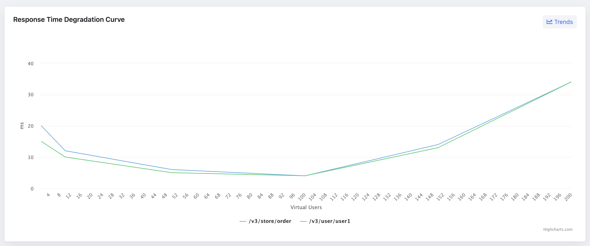

Performance testing stands as a critical phase in the software development lifecycle, aiming to identify potential bottlenecks and ensure that the application meets its performance criteria under anticipated user loads. At the heart of performance testing lies the concept of the degradation curve, a powerful tool that provides insights into how an application's performance changes under various load conditions.
This comprehensive guide delves into every facet of degradation curves in performance testing, equipping you with the knowledge to leverage this tool for enhancing application performance and user satisfaction.

## What is a Degradation Curve?
A degradation curve, in the context of performance testing, plots the relationship between load (number of users) and response time for a system. It is pivotal in understanding how an application's performance degrades, or worsens, as the load increases. The curve typically features several key regions: the single-user region, performance plateau, stress region, and the knee in performance.

## The Role of Degradation Curves in Performance Testing
Degradation curves serve multiple purposes in performance testing, including:
* Identifying Performance Plateaus and Stress Areas: These curves help testers pinpoint the load levels at which an application maintains steady performance (performance plateau) and the points at which performance starts to degrade significantly (stress areas).
* Determining "Good Enough" Performance Levels: By understanding where performance starts to degrade, teams can make informed decisions about acceptable performance levels for their applications.
* Correlating Performance with User Experience: Degradation curves offer insights into how performance issues might affect end-user experience, helping teams prioritize performance improvements.

## Analyzing Degradation Curves
### Components of a Degradation Curve
1. The Single-User Region: This part of the curve represents the response time when only a single user is accessing the system. It provides a baseline for optimal performance.
2. The Performance Plateau: This region indicates the range of user load under which the application performs optimally without significant degradation.
3. The Stress Region: Here, the application begins to degrade gracefully under increasing load, marking the onset of performance issues.
4. The Knee in Performance: This critical point signifies where performance degradation becomes severe, indicating the maximum load the application can handle before experiencing unacceptable performance.

## Interpretation of Degradation Curves
Interpreting degradation curves requires understanding the nuances of each region:
* Single-User Region: Ideal response times here set the expectation for the application's best-case performance.
* Performance Plateau: Identifying this area helps in understanding the optimal load range and setting realistic performance benchmarks.
* Stress Region and Knee in Performance: These indicate the limits of acceptable performance, guiding performance tuning efforts and capacity planning.

## Building Performance-Degradation Curves
Creating a degradation curve involves a series of steps, starting with setting up the performance testing environment and culminating in the analysis of gathered data. Key tools and technologies for generating degradation curves include load testing tools like JMeter, LoadRunner, and Gatling. These tools simulate various user loads on the application and measure the response times at each load level.
Step-by-Step Process for Creating a Degradation Curve
1. Setting Up the Performance Testing Environment: This involves configuring the test environment to mimic the production environment as closely as possible.
2. Executing the Test and Collecting Data: Tests are run at incremental load levels to gather data on response times and other relevant metrics.
3. Plotting the Degradation Curve: Using the collected data, a curve is plotted with load levels on the x-axis and response times on the y-axis.

### Complex Performance-Testing Scenarios
Understanding and analyzing degradation curves becomes even more critical when dealing with complex performance-testing scenarios. These scenarios might involve varying user behaviors, concurrent access patterns, or the introduction of new application features that could potentially alter performance dynamics.

### Modeling User Behavior and Workload Distribution
Creating sophisticated models that simulate real-world user interactions with the application is a key. By incorporating these models into performance testing, teams can generate more accurate degradation curves that reflect a wide range of user behaviors and workload distributions. This approach enables a deeper understanding of how different user types impact application performance.

### Applying Degradation Curves to Complex Scenarios
In complex scenarios, degradation curves can illustrate how changes in user behavior or workload distribution affect application performance. For example, an increase in the number of users performing data-intensive operations might shift the performance plateau earlier in the curve, indicating a need for optimization in handling such operations.

## Strategies for Performance Improvement
Once degradation curves have been analyzed, the next step involves using this data to guide performance improvement strategies. This might include identifying and addressing bottlenecks, optimizing code, or scaling infrastructure.

Degradation curves can highlight performance bottlenecks by showing where response times begin to degrade significantly. Identifying these bottlenecks is the first step toward implementing fixes, which might involve code optimization, database indexing, or enhancing server capacity.

The goal of performance tuning is often to shift the knee in the degradation curve to the right, thereby increasing the maximum load the application can handle before performance degrades ungracefully. This can be achieved through various strategies, including optimizing application code, improving database performance, and scaling out infrastructure.

## Conclusion
Degradation curves are a powerful tool in the performance tester's arsenal, offering detailed insights into how applications behave under load.
By understanding and applying the principles outlined in this guide, testing teams can enhance application performance, meet user expectations, and ultimately contribute to the success of their software projects.

## Generation Degradation Curve With JtlReporter
Traditionally, creating the degradation curve was done in Excel or any other similar tool. This is indeed very manual and not too scalable solution. As the test scenario outcomes had to be copied from the tests outputs from tools like JMeter, Locust, Gatling, etc. and copied
into Excel. With every new test result the procedure must be done again. With JtlReporter you get the degradation curve for each scenario out of the box, without any manual steps needed.
