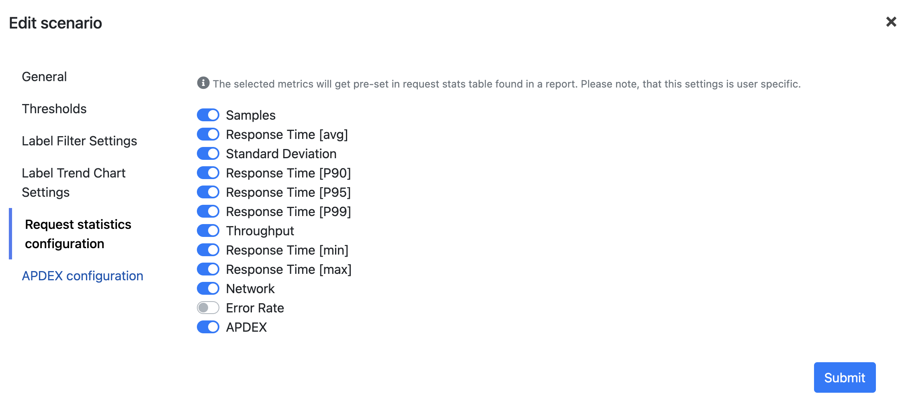

:::note
The settings is user specific. This means that the settings will be applied only for you.
:::

The application comes with default set of metrics, that are displayed in the request statistics table in the report detail. However, you can customize the list of metrics to be displayed in the report.

1. Navigate to scenario detail.
2. Open the context menu by click the hamburger icon in the top right corner of the page. And select **Settings**.
3. Click on **Request statistics configuration** tab.
4. Adjust the list of metrics to be displayed in the report and click **Submit**.

