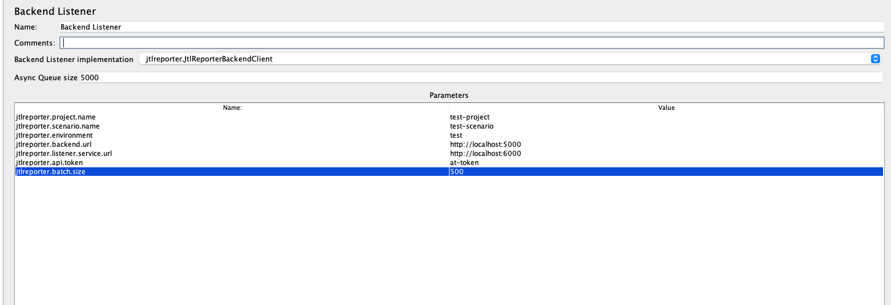

To integrate JMeter with JtlReport you  have two options:
1. Generate CSV file and upload it to the application.
2. Leverage the jtl listener service and upload the results continuously during test execution using JtlReporter JMeter Backend Listener Plugin.

## 1. Generating and uploading JTL file

:::warning
Only a comma `,` is supported as a delimiter.
:::

JMeter offers you two output formats - xml and CSV. In order to make it work with JtlReporter you will need to use the CSV output, please see [the expected CSV format](/docs/integrations/introduction#csv-data-format). JMeter does not export all of these data by default (eg: *URL*, *Hostname*). Please refer to [JMeter docs](https://jmeter.apache.org/usermanual/listeners.html#defaults) on how to expose them.

:::note
If you run your tests in **distributed mode** you need to provide *Hostname* in csv output. You can do it by setting `jmeter.save.saveservice.hostname=true` in `jmeter.properties`
:::

Once you have `.jtl` (CSV) output ready, upload it to the application either via **[UI](/docs/guides/manual-data-upload)** or **[REST API](/docs/guides/api-data-upload)**.

## 2. Continuous results uploading
 
If you would like to take the advantage of continuous data results uploading, you need to install [JtlReporter JMeter Backend Listener Plugin](https://github.com/ludeknovy/jtl-reporter-jmeter-backend-listener/packages/1917620).
and make sure that the JtlReporter Listener Service is running. 

The plugin creates a new test run for a given project and scenario and steams the measurements into JtlReporter listener service in batches. After the test execution is finished it triggers the report processing. By using this plugin you can significantly reduce the processing time in comparison with JTL/CSV file upload.

### JtlReporter JMeter Backend Listener Plugin

1. Download the [JtlReporter JMeter Backend Listener Plugin](https://github.com/ludeknovy/jtl-reporter-jmeter-backend-listener/packages/1917620)
2. Copy the `.jar` file into `<jmeter_path>/libexec/lib/ext`
3. Add a backend listener to your Jmeter script and select `jtlreporter.JtlReporterBackendClient` as Backend Listener implementation
4. Fill all the following properties:
    * `jtlreporter.project.name`, existing project name.
    * `jtlreporter.scenario.name`, existing scenario name.
    * `jtlreporter.environment`, test environment. 
    * `jtlreporter.backend.url`, JtlReporter Backend url. 
    * `jtlreporter.listener.service.url`, JtlReporter Listener Service url. 
    * `jtlreporter.api.token`, [API token](/docs/guides/administration/api-token). 
    * `jtlreporter.batch.size`, max value is 500.
5. Once you execute your test, it will create a new test run automatically and upload the samples during the test execution.

